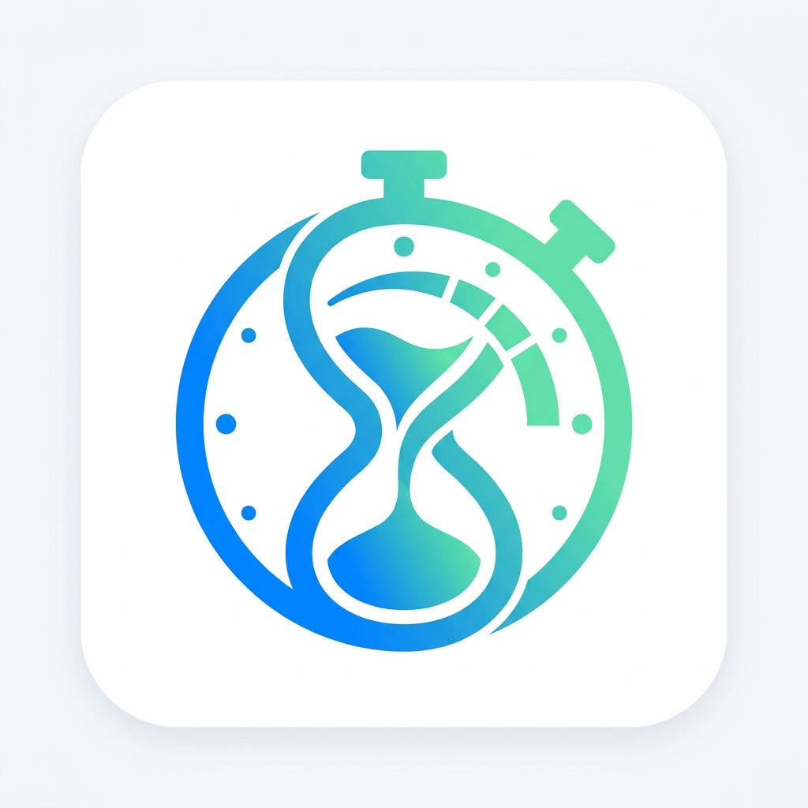

<div align="center">
  
  <h1>Bottleneck: Time in Status & SLAs</h1>
  <p><strong>A production-ready monday.com marketplace application</strong></p>
  <p>Track time in status, detect bottlenecks, automate SLAs, and run precision Time Tracking Automations.</p>
</div>

---

- 📄 **[Service Level Agreement (SLA)](APP_SLA.md)**: 99.9% uptime commitment, incident response matrix, and data protection standards.
- 📦 **[Marketplace Listing Copy](MARKETPLACE_LISTING.md)**: Marketplace title, tagline, descriptions, and feature breakdown.

---

## 🏗️ Architecture & Monorepo Structure

```
Monday.com/
├── docker-compose.yml          # Provisions PostgreSQL 15, Redis 7, Backend, and Frontend
├── docker-compose.prod.yml     # Production overrides (Nginx static frontend, compiled backend)
├── .env.example                # Example environment variables template
├── .env                        # Local environment variables
├── backend/                    # Node.js + Express + Prisma + BullMQ
│   ├── Dockerfile              # Multi-stage Dockerfile (dev + prod)
│   ├── package.json
│   ├── tsconfig.json
│   └── src/
│       ├── app.ts              # Express application configuration
│       └── index.ts            # Server entrypoint
└── frontend/                   # React + Vite + TypeScript + Monday Vibe Design System
    ├── Dockerfile              # Multi-stage Dockerfile (dev + nginx prod)
    ├── nginx.conf              # Nginx reverse proxy with monday.com iframe security headers
    ├── package.json
    ├── vite.config.ts
    └── src/
        ├── App.tsx             # Main Dashboard
        └── main.tsx            # Entrypoint
```

---

## 🚀 Quickstart with Docker Compose

### 1. Configure Environment
Copy the `.env.example` file to `.env`:
```bash
cp .env.example .env
```

### 2. Start All Services (Development Mode)
```bash
docker compose up --build
```
This will start:
- **Frontend:** http://localhost:5173 (with hot module replacement)
- **Backend API:** http://localhost:8080 (with ts-node/nodemon reload)
- **PostgreSQL 15:** `localhost:5432` (`bottleneck_db`)
- **Redis 7:** `localhost:6379`

### 3. Verify Health
- Backend healthcheck: `http://localhost:8080/health`
- Frontend UI: `http://localhost:5173`

---

## 🛠️ Step-by-Step Implementation Roadmap
- [x] **Step 1:** Docker & Project Scaffolding (Monorepo, Dockerfiles, docker-compose, .env)
- [ ] **Step 2:** Database Setup & ORM (Prisma schema: `StatusEvents` & `SLARules` models with indexes)
- [ ] **Step 3:** Webhooks & Monday API Client (Webhook verification challenge, event parsing, GraphQL client)
- [ ] **Step 4:** Redis Caching & BullMQ Background Jobs (SLA violation scanner & aggregation caching)
- [ ] **Step 5:** Frontend UI & Monday Vibe Integration (Bottleneck Hub, 1-Click Nudge Action)
